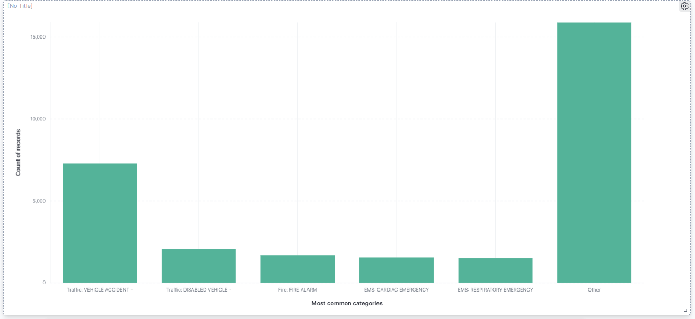
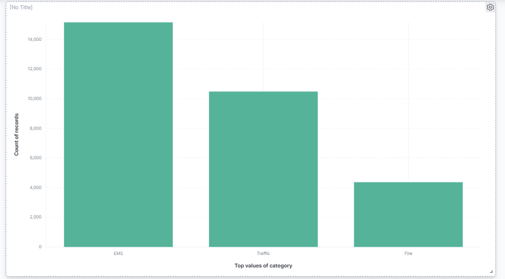
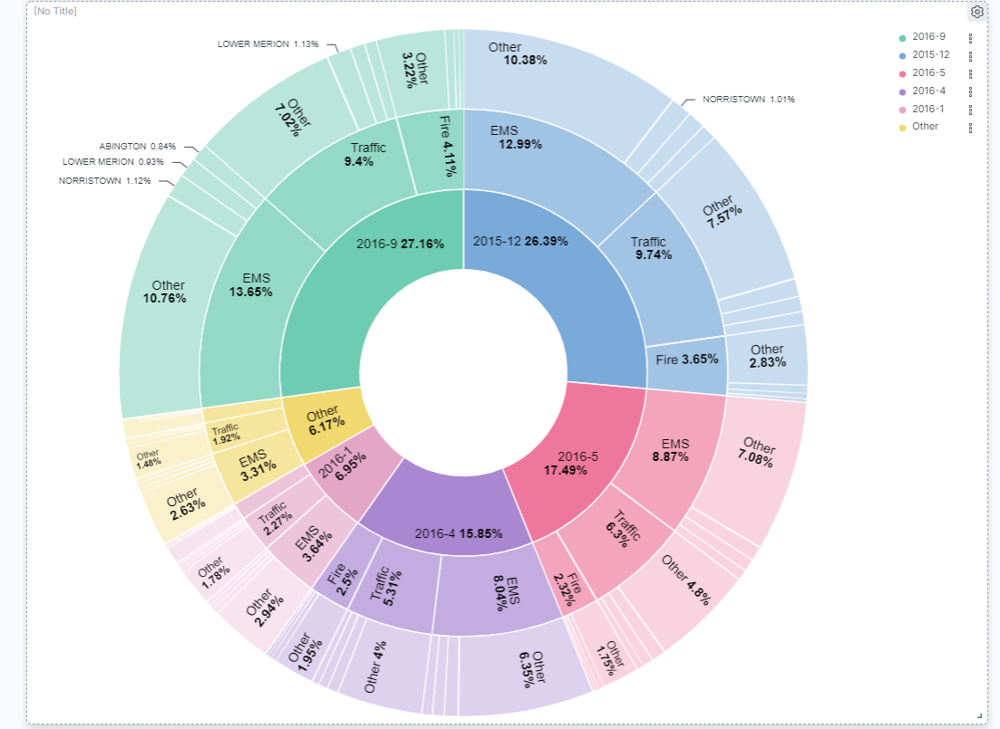
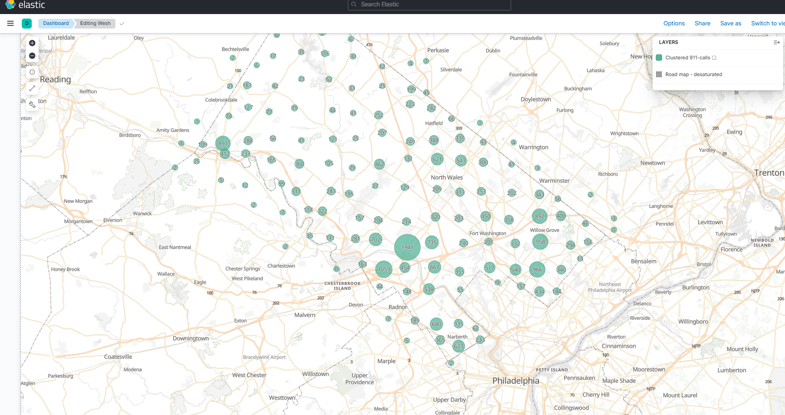

# 911 Calls avec ElasticSearch

## Import du jeu de données

Pour importer le jeu de données, complétez le script `import.js` (ici aussi, cherchez le `TODO` dans le code :wink:).

Exécutez-le ensuite :

```bash
npm install
node import.js
```

Vérifiez que les données ont été importées correctement grâce au shell (le nombre total de documents doit être `153194`) :

```
GET <nom de votre index>/_count
```

## Requêtes

À vous de jouer ! Écrivez les requêtes ElasticSearch permettant de résoudre les problèmes posés.

```js
TODO : ajouter les requêtes ElasticSearch ici

// Compter le nombre d'appels par catégorie
GET /911-calls/_count
{
    "query": {
        "wildcard": {
           "title": {
              "value": "ems*"
           }
        }
    }
}

GET /911-calls/_count
{
    "query": {
        "wildcard": {
           "title": {
              "value": "fire*"
           }
        }
    }
}

GET /911-calls/_count
{
    "query": {
        "wildcard": {
           "title": {
              "value": "traffic*"
           }
        }
    }
}

// Trouver les 3 mois ayant comptabilisés le plus d'appels
GET /911-calls/_search
{
  "size": 0,
  "aggs" : {
    "yearMonth" : {
      "terms": {
        "field": "yearMonth"
      }
    }
  }
}

// Trouver le top 3 des villes avec le plus d'appels pour overdose
// EMS: OVERDOSE
GET /911-calls/_search
{
  "size": 0,
  "query": {
    "match": {
      "title": "EMS: OVERDOSE"
    }
  },
  "aggs" : {
    "twp" : {
      "terms": {
        "field": "twp",
        "order" : { "myCount" : "desc" }
      },
      "aggs" : {
          "myCount" : {
              "value_count": {
                "field" : "twp"
              }
          }
      }
    }
  }
}

// Compter le nombre d'appels autour de Lansdale dans un rayon de 500 mètres
// Coordonnées GPS du quartier de Lansdale, PA, USA:
// Latitude: 40.241493
// Longitude: -75.283783
GET /911-calls/_count
{
  "query": {
    "bool": {
      "must": {
        "match_all": {}
      },
      "filter": {
        "geo_distance": {
          "distance": "500m",
          "location": {
            "lat": 40.241493,
            "lon": -75.283783
          }
        }
      }
    }
  }
}
```

## Kibana

Dans Kibana, créez un dashboard qui permet de visualiser :

(Nous n'avons pas inséré toute la bdd donc le résultat n'est pas exactement le bon)

- Un histogramme des appels répartis par catégories




- Un Pie chart réparti par mois, par catégories et par canton (township `twp`)



- Une carte de l'ensemble des appels



Pour nous permettre d'évaluer votre travail, ajoutez une capture d'écran du dashboard dans ce répertoire [images](images).

### Bonus : Timelion

Timelion est un outil de visualisation des timeseries accessible via Kibana à l'aide du bouton : 

Réalisez le diagramme suivant :


Envoyer la réponse sous la forme de la requête Timelion ci-dessous:

```
TODO : ajouter la requête Timelion ici
```
